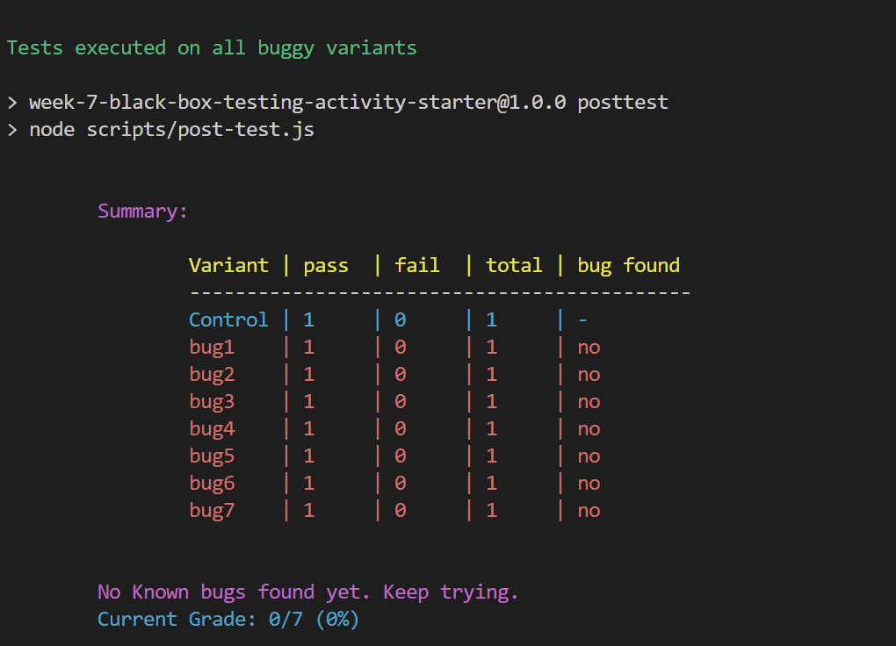
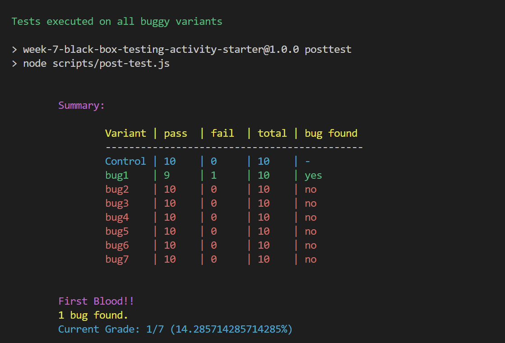
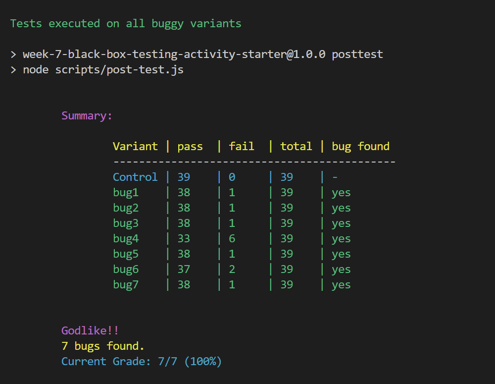
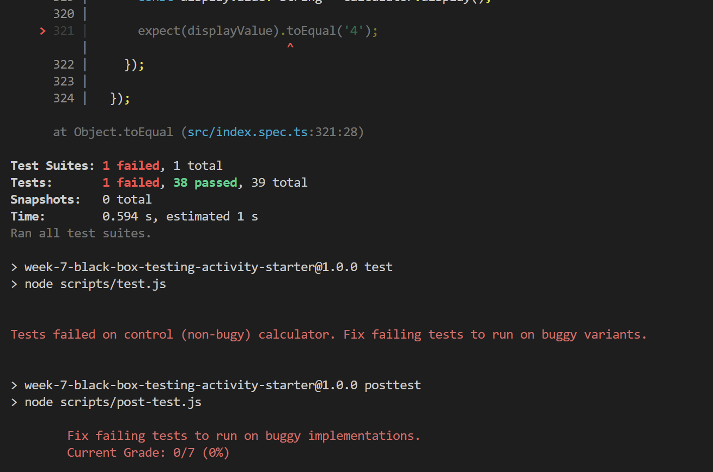

# Week 7 Activity - Black Box Testing

Welcome to the Week 7 activity on Black Box Testing.
Continuing with the theme of a calculator for in-class activities, we will write integration tests for a State Design Pattern based implementation of a calculator.
The developer who wrote this code turns out to be a bit overconfident and did not find it necessary to write tests for the implementation.
The other instructors, however, did not share the same level of confidence in the implementation (how could they? The developer doesn't even know the design recipe from Fundies).
Thus, the instructor tested the code and found 7 independent bugs.

- Your job today, is to find these 7 known bugs.
- Submission instructions at the end. Please read those before submitting to gradescope.

## About the code

Things are a lot simpler than usual today.
The bundled buggy calculator is given in `src/libs/buggy-calculator.js`.
We don't need to look at it (it's not much to look at anyway, just a bundled js file), but it's good to know where it is.
*Note*: You may be tempted to prettify the file and find the bugs there. It's probably easier to just write tests instead.

The `src/index.ts` file defines the interface for the calculator. It is slightly different from previous assignments but easy enough to understand.
You have explicit `pressX()` methods instead of generic `pressNumericKey(key)`.
The `display()` method returns the contents of the buffer.

*Note*: You can assume that the `display`, `equals`, and `clear` keys work correctly, and need not be tested.
Other than that, who knows what works and what doesn't.

*IMPORTANT:* All tests MUST pass on the non-buggy calculator.

The file that we are really interested in is `src/index.spec.ts`.

## The Task

- The task for today is to write tests in `src/index.spec.ts` for the provided calculator.
- There is one sample test given in the spec file.
- The testing framework is jest.
- Do NOT mess with any code in `index.ts` or any scripts or configs. Things are a little brittle and your time is better spent writing tests instead.
- Do NOT mess with the setup code in `beforeEach` in `index.spec.ts`.     

As you write more tests and find more bugs, you will see how many bugs have been found and your grade as shown below:

- No bugs found:

- One bug found:

- All bugs found:

- Tests failing on the non-buggy calculator:

## Submission

In the root directory (the one containing `package.json`), run the command `npm run zip`. 
This command will generate a zip file called `submission.zip`.
Upload the `submission.zip` file to Gradescope and tag your partner on Gradescope on the submission.

## Grading

Your grade depends on the number of bugs you find. Find all 7 bugs to receive full credit.
